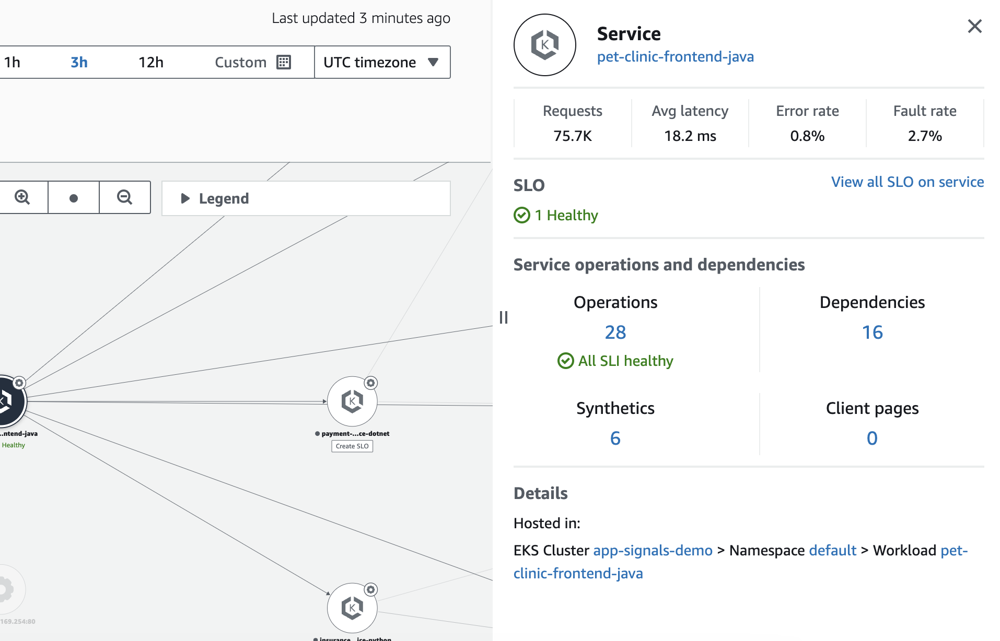
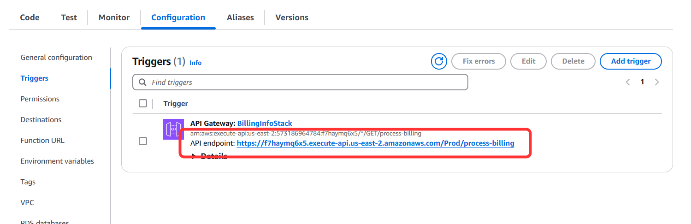

# COP 401 - Connecting the dots: Get hands-on experience with distributed tracing

***Shane - scarragh@amazon.com***

Trace id (Same across) and Span Id (Parent & Child to tie)
 - Sampling Strategies
 - Transaction Search
  -- Lower Cost to Ingest
 - Instrumentation
  -- Automatic
  -- Manual


Distributed tracing is a crucial observability technique for understanding complex, microservices-based applications on AWS. In this session, you'll learn how to leverage Amazon CloudWatch to instrument your applications and collect tracing data, enabling you to identify performance bottlenecks, debug issues, and optimize your systems. By the end of this session, you'll have the knowledge and skills to unlock the full potential of distributed tracing and enhance the observability of your AWS-based applications, driving better decision-making for your business.

You will learn about AWS observability functionalities on Amazcon Cloudwatch Application Signals  and AWS X-Ray . This workshop will deploy a microservice-based application and guide you in discovering actionable insights through various monitoring tools. Upon conclusion, the learner is expected to have a clear understanding of traces as well as techniques for utilizing them across a variety of workload types.

This is an advanced level workshop and expects that the learner has experience with basic understanding of AWS Observability services field. While you don't need to be an expert to take this workshop, it will help if you had some basic understanding about monitoring concepts such as traces .


# Observability on AWS
Full-stack observability at AWS includes AWS-native, Application Performance Monitoring (APM), and open-source solutions, giving you the ability to understand what is happening across your technology stack at any time.

AWS observability lets you collect, correlate, aggregate, and analyze telemetry in your network, infrastructure, and applications in the cloud, hybrid, or on-premises environments so you can gain insights into the behavior, performance, and health of your system. These insights help you detect, investigate, and remediate problems faster; and coupled with artificial intelligence and machine learning, proactively react, predict, and prevent problems.


For this Builder Session, we are using a sample application "PetClinic".

The following architecture diagram illustrates the various components of the PetClinic application. By this point, you should have the PetClinic application running in a pre provided AWS account provided to you by the Workshop team.


To make it easy to get started with Application Signals, we have provided a sample application to get started with testing the end-to-end Application Signals functionality in just a few simple steps. The sample application is composed of 6 services that run the Spring “Pet Clinic” application and a Django web application. These services are running on Amazon EKS on Amazon EC2 and leverage Terraform to enable the cluster with the AWS Distro for OpenTelemetry (ADOT) auto-instrumentation agents for Java and Python.

The diagram below illustrates the overall Pet Clinic application architecture.


# Auto Instrumentation
## Application Signals lab
One of the challenges with distributed systems is that they are made up of many interdependent services, which add a degree of complexity when you are trying to monitor their performance. Determining which services and APIs are experiencing high latencies or degraded availability requires manually putting together telemetry signals. This can result in time and effort establishing the root cause of any issues with the system due to the inconsistent experiences across metrics, traces, logs, real user monitoring, and synthetic monitoring.

You want to provide your customers with continuously available and high-performing applications. At the same time, the monitoring that assures this must be efficient, cost-effective, and without undifferentiated heavy lifting.

Amazon CloudWatch Application Signals helps you automatically instrument applications based on best practices for application performance. There is no manual effort, no custom code, and no custom dashboards. You get a pre-built, standardized dashboard showing the most important metrics, such as volume of requests, availability, latency, and more, for the performance of your applications.

You will learn about various AWS CloudWatch Application Signals features, including:

Services: To see your services along with key service metrics to provide an overall view of service activity.
Service Level Objectives (SLOs): Create and monitor service level objectives for your critical business operations.
Service Map: An advanced visualization tool that not only helps you filter spans through structured logs but also provides a more interactive and detailed view of your application's topology compared to X-Ray's service map.
Synthetics: Configurable scripts that run on a schedule to monitor your endpoints and APIs, offering proactive monitoring capabilities beyond X-Ray's scope.
In this hands-on module, you will learn how to enable and use Application Signals to monitor Amazon EKS workloads running on Amazon EC2. By the end of this lab, you'll be proficient in using CloudWatch Application Signals to debug issues in a microservices architecture. You'll understand how to trace requests across services, identify performance bottlenecks, and quickly pinpoint the root cause of problems in the an application. Moreover, you'll appreciate how Application Signals provides a more holistic view of your application's health and performance, integrating traces, metrics, and logs in a single, unified interface - an advantage over using X-Ray alone.

Application Signal is available for following services - 


### Enabling Application Signal

Now that you enabled the Application Signals, wait 2-3 minutes until the discovery bring some data.

Automatic Instrumentation is a technique used in software development and monitoring that automatically adds code or hooks to an application to collect performance data, track errors, and gather other relevant metrics without requiring developers to manually modify their codebase. This process is typically implemented through libraries, agents, or frameworks that integrate with the application's runtime environment.

Automatic instrumentation on the EKS Cluster is achieved by adding a special note (called an annotation) in the configuration file (manifest) that defines how this workload should be set up and run. In this case an annotation is being used to indicate that this workload should be monitored using OpenTelemetry. The Amazon CloudWatch Observability EKS add-on will immediately inject AWS Distro for OpenTelemetry auto instrumentation (ADOT) SDKs into your pods and trigger pod restarts to enable collection of application metrics and traces.

In our example, one of our EKS Services called the billing-service-python is coded using Python, when enabling Automatic Instrumentation via Application Signals, this annotation in the manifest will look similar to the following:

```
apiVersion: apps/v1
kind: Deployment
metadata:
  name: billing-service-python
spec:
  replicas: 1
  selector:
    matchLabels:
      io.kompose.service: billing-service-python
  template:
    metadata:
      labels:
        io.kompose.service: billing-service-python
      annotations:
        instrumentation.opentelemetry.io/inject-python: 'true' <----
 <rest of the file>
 ```


In the context of this service, once its re-deployed, the data flow will look like the following:

Python Application Code → OTEL Auto Instrumentation Library - Your code is automatically instrumented by these libraries.
Auto Instrumentation Libraries → OpenTelemetry API - The libraries use the standardized OTel API for instrumentation.
Application Code → OpenTelemetry API - Your application runs and the library generates telemetry data (traces, metrics, logs) and call the OpenTelemetry API.
OpenTelemetry API → OpenTelemetry SDK - The OTEL API passes the telemetry data to the OTEL SDK, which processes it.
OpenTelemetry SDK → OpenTelemetry Collector - The SDK exports telemetry data to the Collector i.e. ADOT or the CWAgent
Telemetry Collector → Observability Backend - The Collector receives and forwards processed data to the backend system.


---------
# Visualizing application using CloudWatch Application Signals
## Viewing Services
Application Signals will automatically discover and populate a list of services with no additional setup other than to install the CloudWatch Agent Operator  and emit telemetry data to Application Signals. This discovery is done using a combination of CloudWatch Embedded Metric Format (EMF ) Logs and AWS X-Ray traces.

Services instrumented with Application Signals collect the following data:

- CloudWatch Embedded Metric Format Logs for Application Metrics:
  - Metric Names
    - Latency
    - Fault
    - Error
  - Metric Dimensions
    - Service - name of the service
    - Operation - name of the API operation
    - EKS Cluster - name of the EKS cluster where the services are running
    - K8s.Namespace - name of the EKS namespace where the services are running
- AWS X-Ray traces - for more information on the data collected through tracing, see AWS X-Ray concepts .

In the case of the Pet Clinic application, there are 6 services which should be automatically discovered: the customers-service, the pet-clinic-frontend, the vets-service, the visits-service, the insurance-service and the billing-service.

```Note: Services are automatically discovered based on the telemetry data (logs) emitted from your Application Signals instrumented service. Please verify that you have followed the steps noted above to instrument your EKS services and have setup the proper role with trust policy and permissions. It may take up to 5 minutes after data has been collected for your services to be discovered and appear in the list.```
## Services Dashboard
CloudWatch Application Signals automatically discovers and populates a list of services without requiring any additional setup under the Services dashboard out of the box. This unified, application-centric view helps provide a full perspective of how users are interacting with your service. This can help you triage issues if performance anomalies occur.

Navigate to the CloudWatch console  and choose Services under the Application Signals section in the left navigation pane.


## Service Operations and Dependencies
The Service detail page displays an overview of your services, operations, dependencies, canaries, and client requests for a single service that has been enabled for Application Signals. To view this page, open the CloudWatch console , choose Services under the Application Signals section in the left navigation pane, and choose the insurance-service-python service from the Services table.

By viewing an individual service details page, you can view service operations, dependencies, CloudWatch Synthetics, and their corresponding metrics. This unified view helps you to gain a full perspective of how users are interacting with your service to better help you triage where attention may be needed when performance anomalies occur.

1. As shown below Service Overview section summarizes the components that make up your service, and highlights key performance metrics to help you identify issues that require troubleshooting.


2. Navigate to the Service operations tab, choose an operation, and click on a specific time point on the metrics chart to open a pane which contains Correlated traces, Top contributors and Application logs associated with the selected point.


3. Choose the Dependencies tab to view the dependencies that your application has along with the critical application metrics for each dependency. This view provides a summary of your service dependencies. You can narrow your view to a specific service operation by using the dropdown.


4. Explore the metrics provided about each dependency in the table. The Remote Operation and Target columns provides details about the request made to a dependency. Additional columns provide key metrics for each dependency.

## View Correlated Telemetry
Application Signals also adds linkage between service operations metrics datapoints to traces. When you are troubleshooting issues, you may notice spikes in application metrics, and then have drill down to metrics about the infrastructure that runs the application (such as instance CPU). Or, you may drill down to traces and application log entries about the requests that contributed to the spike in the metrics.

When you spot a performance anomaly, these correlated traces can help to diagnose the root cause. From the service details page, you can narrow in on a moment in time on one of the three graphs and correlate changes in application performance metrics using traces.

1. Return to the Service operations tab.
2. To view correlated traces and to diagnose a performance anomaly, click on a data point directly in one of the three graphs above the table. Clicking a data point in the charts will populate the right-hand drawer with filtered traces from the time period. These traces will be sorted/filtered based on the graph selected (for example, clicking on the Latency graph will sort traces by service response time, clicking availability or faults/errors will filter the traces by Trace status).

On the tab click on the Top Contributors - Top Contributors is a powerful feature that automatically identifies and highlights the most significant sources of latency, errors, or performance issues across your application's services, enabling teams to quickly focus their troubleshooting efforts on the most impactful elements of their system. The Top Contributors section directly displays metrics for Call Volume, Availability, Average Latency, Errors and Faults, broken down by infrastructure components. The Application Logs tab shows you a Logs Insights query to view related application logs.


On The tab, also click on **Application Logs**


Go back to the Correlated Traces in the tab

3. Select a trace ID link from the Correlated traces to view the trace map as well as the segments timeline and any related log for the trace.


Note: Correlated traces will only display when traces have been collected during that time period. If this is the case you may either need to generate more traffic to your service, or update the sampling rule to sample a higher percentage of traces. By default, the sampling is set to 5%, meaning only 5% of traffic to your service will generate traces.
You can click in a node in the MAP to see the tabs with Overview, Resources, Annotations, Exceptions, etc.

5. Click on PostgreSQL node in the MAP, then in the TAB go to SQL.


You can see the executed query for that specific trace, also the user that ran.

---

# Service Map in Application Signals
After you enable your application for Application Signals, use the service map to make it easier to monitor your application's operational health.

View connections between client, canary, service, and dependency nodes to help you understand your application topology and execution flow. This is especially helpful if your service operators are not your development team.

See which services are meeting or not meeting your service level objectives (SLOs). When a service is not meeting your SLOs, you can quickly identify whether a downstream service or dependency might be contributing to the issue or impacting multiple upstream services.

Select an individual client, synthetics canary, service, or dependency node to see related metrics. The Service details page shows more detailed information about operations, dependencies, synthetics canaries, and client pages.

Filter and zoom the service map to make it easier to focus on a part of your application topology, or see the entire map. Create a filter by choosing one or more properties from the filter text box. As you choose each property, you are guided through filter criteria. You will see the complete filter below the filter text box. Choose Clear filters at any time to remove the filter.

1. On the navigation pane, choose Application Signals, Service Map.
You will see something like this:


Click on pet-clinic-frontend-java

In the left panel, you will see some informations:



This information is helpful for you understand the actual values of requests, latency, error rate and fault rate.

Also you can check:

 - Actual SLI Values (When Configured)
 - Total dependencies for that node
 - Total Operations for that node
 - Syntethics associated
  - Client pages (Cloudwatch RUM)

*The Cloudwatch RUM is not in the scope of this workshop, and not enabled.*

You also can see the cluster and namespace.

Go back to the Service Map, in the top you can see the option to create filters


Let's say you would like to know about a specific workload

filter by Workload = insurance-service-python


When you do that, the Service Map highlight only the path is necessary for this workload

Thats an example how to use Service Map to help you gather insights from your environment

This conclude the section about how to use Application Signals for troubleshooting.

---
# Troubleshoot using Application Signals

Let's now look at how to troubleshoot a real life scenario using Cloudwatch Application Signals. As you explored earlier that we are using a sample application "PetClinic" for this workshop and we will go through the following steps to identify an error with customers-service-java microservice.
 1. Navigate to the CloudWatch console  and choose Services under the Application Signals section in the left navigation pane. CloudWatch Application Signals automatically discovers and populates a list of services without requiring any additional setup under the Services dashboard out of the box.

  2. Notice the fault rate for customers-service-java service and your goal is to identify the associated fault and errors that are potentially impacting the availability of this service. Click on the service name to navigate to the service detail page.
This page displays an overview of your services, operations, dependencies, canaries, and client requests for a single service that has been enabled for Application Signals. This unified view helps you to gain a full perspective of how users are interacting with your service to better help you triage potential issues.

Navigate to the Service operations tab, and notice that `POST /owners/{ownerId}/pets` operation has maximum fault rate.


  4. Explore the Selected operation: POST /owners/{ownerId}/pets section on top of the page and click on the associated fault data point in the Faults and Errors graph. This will open the detail view where Application Signals provide linkage between service operations metrics datapoints to traces.
*Notice that the correlated traces depicts the service status as Fault (5xx) that indicates a fault within these traces.*


 5. Now let's deep dive to identify the root cause of these faults. Click on any of trace with fault status to navigate to the trace detail page. Scroll down to the segment timeline section and you will notice that the SQS segment depicts 4xx Error.
[Customer Service Trace Detail!](image-20.png)

  5. Click on the SQS segment that will display the segment details section containing associated Resources, Annotations, Metadata, Exceptions along with other details for that particular trace segment. Scroll to the Exceptions tab to see the exception related to this fault.


As you can notice that it lists down the throttling exception for PurgeQueue operation along with the detailed stack trace.

---
# Manual Instrumentation

You have seen the actual architecture with all the Automatic Instrumentation, but now your manager asks you to gather data from a DynamoDB table BillingInfo, to return the quantity of owners by pet, also you need to gather the traces from this Lambda function to get information from the DynamoDB table, and you need to manually instrument this Lambda.

This is the new architecture:


Your job now is create/change the lambda to manual instrument and send traces to X-ray.

## How to instrument

Imagine you're a cloud engineer at the PetClinic. The CEO has urgently requested a way to gather and analyze real-time sales data across all product categories for an upcoming investor meeting. You've decided that a Lambda function would be the ideal solution for this task.

Your challenge is to not only ensure that this Lambda function is available for use, but also to instrument it using OpenTelemetry. By adding this instrumentation, you'll be able to monitor the function's performance, identify any bottlenecks, and ensure it's running efficiently.

You'll need to track various metrics such as execution time, memory usage, and any potential errors. Your goal is to deliver reliable, actionable business insights to the CEO while maintaining the ability to troubleshoot and optimize your solution as needed.

### Testing the Lambda Function
The Lambda Function has already been provisioned with simple code that performs the following:

The code sets up to work with Amazon's database (DynamoDB).

It looks at a table called 'BillingInfo' in this database.

It goes through every item in the table, one by one.

For each item, the lambda code:

Looks at the 'billing' part
Finds the 'payment' amount
Adds this amount to a total
At the end, it tells you the total of all the payments it added up.

If anything goes wrong while doing this, it will let you know there was an error.

Lets give it a Test!


You will be provided with a API Gateway URL that will invoke the Lambda Function



You can either click on the click or copy and past it into your browser.
You will be provided with the results:

*Information: The amount you see is subject to change depending on how long the workshop has been running and how many payments have been made*


Now lets move onto the next section where we instrument our Lambda code to provide further insights.

#### How to instrument the lambda function to add tracing
ADOT provides fully managed Lambda layers that package everything you need to collect telemetry data using the OTel SDK. By consuming this layer, you can instrument your Lambda functions without having to modify any function code. You can also configure your layer to do custom initialization of OTel. By default, the layer is configured to export traces to AWS X-Ray. When you enable active tracing, Lambda will try to automatically add the necessary X-Ray permission to your Lambda role if they are missing.

Navigate to the bottom of the page and under the Layers Table click Add Layer


Select the dropdown under AWS layers

Choose AWSOpenTelemetaryDistoPython
For the Version, select Version 5
Then click Add


Enable Active tracing for your lambda function Go back to the function
Choose Configuration and then choose Monitoring and operations tools.
Choose Edit.
Under X-Ray, toggle on Lambda Service Traces.
Choose Save.
Add ADOT Layer

Now that we have added the new layer and enabled tracing, lets test the Lambda function once more to review the changes.

Perform the previous steps carried out in the previous testing section. And once carried out navigate to the Trace Map, you should see a flow similar to the following:

Add ADOT Layer

Please note that you may notice a lag between the function initialization and invocation phases in your X-Ray traces. For functions using provisioned concurrency, this is because Lambda initializes your function instances well in advance of invocation. For functions using unreserved (on-demand) concurrency, Lambda may proactively initialize a function instance, even if there's no invocation. Visually, both of these cases show up as a time gap between the initialization and invocation phases.

Click on the Lambda Context Node then click View Traces

Add ADOT Layer

You should see a screen similar to the below, select one of the traces and investigate the contents.

Add ADOT Layer

The Lambda Layer will automatically instrument our Lambda Function, but we will enhance this by manually instrumenting parts of the code while adding our own custom attributes in the next section.
---

## Add Custom Attributes

Add Custom Attributes
In this section we will use manual instrumentation to enhance our traces generated by the function and to add custom attributes, these are important in tracing for several reasons:

Contextual information: They provide additional context about the traced operation, making it easier to understand what was happening during that specific trace.
Filtering and searching: Custom attributes allow you to filter and search through traces more effectively, helping you find relevant information quickly.
Debugging: They can include specific application-level details that are crucial for debugging issues in complex distributed systems.
Performance analysis: Custom attributes can help identify patterns or correlations between certain attributes and performance metrics.
Business insights: They can include business-specific information, allowing you to connect technical traces with business processes or outcomes.
By leveraging custom attributes effectively, you can significantly enhance the value and utility of your tracing setup, making it a more powerful tool for monitoring, debugging, and optimizing your applications. Our goal is to improve the observability of this function by adding custom attributes to our traces.

```
import json
import boto3
from decimal import Decimal
from opentelemetry import trace
from opentelemetry.instrumentation.aws_lambda import AwsLambdaInstrumentor
from opentelemetry.instrumentation.botocore import BotocoreInstrumentor

def lambda_handler(event, context):
    # Instrument AWS Lambda and Botocore for tracing
    AwsLambdaInstrumentor().instrument()
    BotocoreInstrumentor().instrument()

    # Get a tracer for this module
    tracer = trace.get_tracer(__name__)

    # Start the main span for the lambda handler
    with tracer.start_as_current_span("lambda_handler") as main_span:
        # Set attributes for the main span with Lambda context information
        main_span.set_attribute("faas.name", context.function_name)
        main_span.set_attribute("faas.version", context.function_version)
        main_span.set_attribute("faas.id", context.aws_request_id)
        main_span.set_attribute("faas.max_memory", context.memory_limit_in_mb)

        try:
            # Initialize DynamoDB client
            dynamodb = boto3.resource('dynamodb')
            table_name = 'BillingInfo'
            table = dynamodb.Table(table_name)
            
            total_payment = Decimal('0')
            items_processed = 0

            # Start a span for the DynamoDB scan operation
            with tracer.start_as_current_span("dynamodb_scan_all") as scan_span:
                # Set attributes for the scan span
                scan_span.set_attribute("db.system", "dynamodb")
                scan_span.set_attribute("db.name", table_name)
                scan_span.set_attribute("db.operation", "scan")
                
                # Perform initial scan
                response = table.scan()
                
                # Process all items, including pagination
                while True:
                    # Start a span for processing items
                    with tracer.start_as_current_span("process_items"):
                        for item in response['Items']:
                            billing_data = json.loads(item['billing'])
                            payment = Decimal(billing_data['payment'])
                            total_payment += payment
                            items_processed += 1
                    
                    # Check if there are more items to scan
                    if 'LastEvaluatedKey' not in response:
                        break
                    # If there are more items, continue scanning from the last evaluated key
                    response = table.scan(ExclusiveStartKey=response['LastEvaluatedKey'])
            
            # Return successful response
            return {
                'statusCode': 200,
                'body': json.dumps(f'Total payment: {total_payment}')
            }

        except Exception as e:
            # Start an error handling span if an exception occurs
            with tracer.start_as_current_span("error_handling") as error_span:
                error_message = str(e)
                # Set attributes for the error span
                error_span.set_attribute("error.message", error_message)
                error_span.set_attribute("error.type", type(e).__name__)
                error_span.record_exception(e)
                
                print(f"Error: {error_message}")
                # Return error response
                return {
                    'statusCode': 500,
                    'body': json.dumps(f'Error: {error_message}')
                }
                
```

Here we manually introduce the following:

Instrumentation and Tracing: The second snippet introduces OpenTelemetry instrumentation for AWS Lambda and Botocore. This allows for detailed tracing and monitoring of the Lambda function's execution.
Span Creation: The second snippet creates spans for different parts of the code execution, such as the main handler, DynamoDB scan, and error handling. This provides more granular insights into the function's performance and behavior.
Attribute Setting: The second snippet sets various attributes on the spans, including function name, version, request ID, and memory limit. It also adds attributes for database operations and error details.
Identifying Key Business Metrics

Our function calculates two important metrics:

total_payment: The sum of all payments processed
items_processed: The number of billing items processed
These metrics provide crucial business context that's currently not visible in our traces.

Adding Custom Attributes

Let's add these metrics as custom attributes to our main span. Add the following lines just before the return statement in the try block:

1
2
3
# Add summary attributes to the main span
main_span.set_attribute("total_payment", str(total_payment))
main_span.set_attribute("items_processed", items_processed)

Custom Attributes

We have now added useful attributes to the trace

Advanced Custom Attributes

Let's add more context with advanced attributes. Add these lines:

1
2
main_span.set_attribute("average_payment", str(total_payment / items_processed if items_processed > 0 else 0))
main_span.set_attribute("processing_time_per_item", context.get_remaining_time_in_millis() / items_processed if items_processed > 0 else 0)


Please indent the code properly to avoid any build issues.

Deploy and test the function using the API gateway endpoint before proceeding to further sections.

Please refer to this section for complete Lambda Function Code
Let's explore in Looking on the X-ray section on how to leverage this additional business metadata we have just added to expedite the diagnosis and reduce your overall MTTR (Mean time to resolve).

Best Practices and Considerations

Remember:

Balance detail with performance impact
Use clear, consistent naming for attributes
Consider security implications of the data you're adding to traces
TODO - Understand
Latency p99
	
Latency p90
	
Latency p50