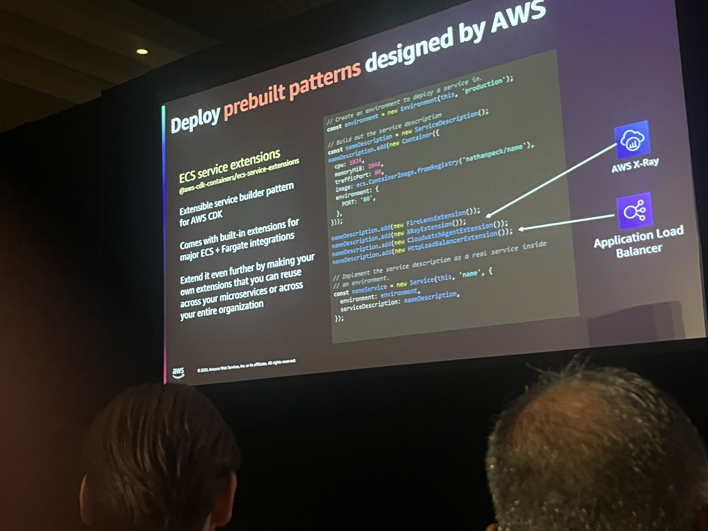
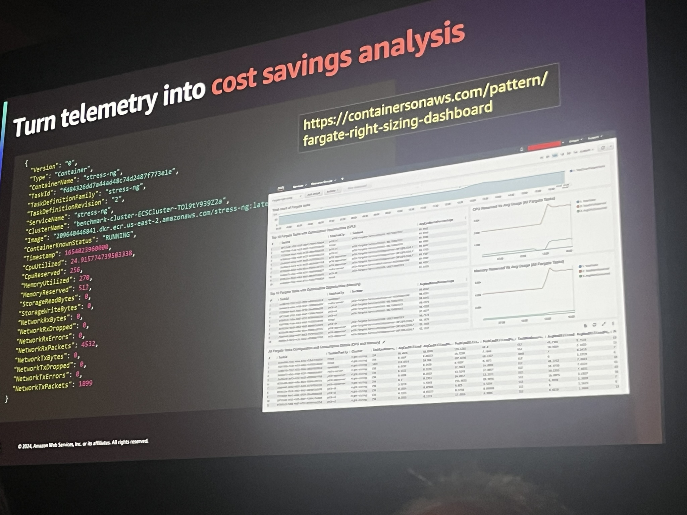

# SVS329 | Simplifying multi-tenancy with SaaS applications on AWS Fargate

There is a growing trend to build SaaS solutions on Amazon ECS. Developing multi-tenant SaaS applications requires addressing multiple concerns, including tenant isolation, tenant onboarding, tenant-specific metering, monitoring, and other SaaS aspects. In this session, explore how to manage multi-tenancy aspects when deploying solutions on Amazon ECS with AWS Fargate.

**Nathan Peck:Senior Developer Advocate, Amazon**
[Nathan Peck](https://nathanpeck.com/)

AWS Extension

[Github Repo](https://github.com/cdklabs/cdk-ecs-service-extensions)

 - Turn Telemetry into cost saving analysis 

[ContainersonAWS - It has lots of patterns](https://containersonaws.com/)