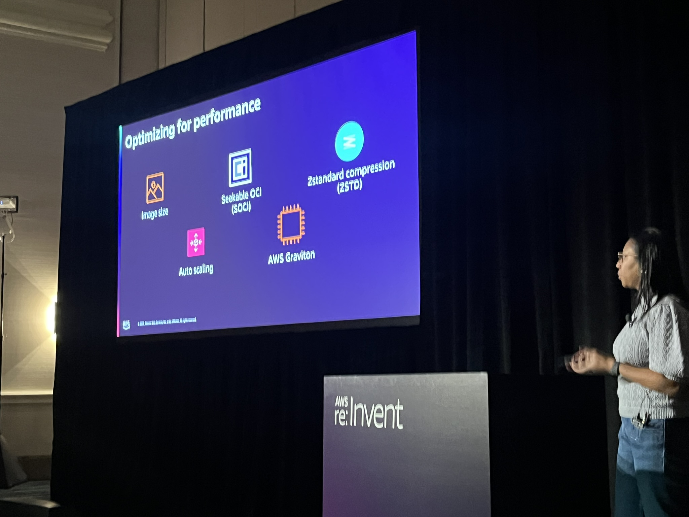
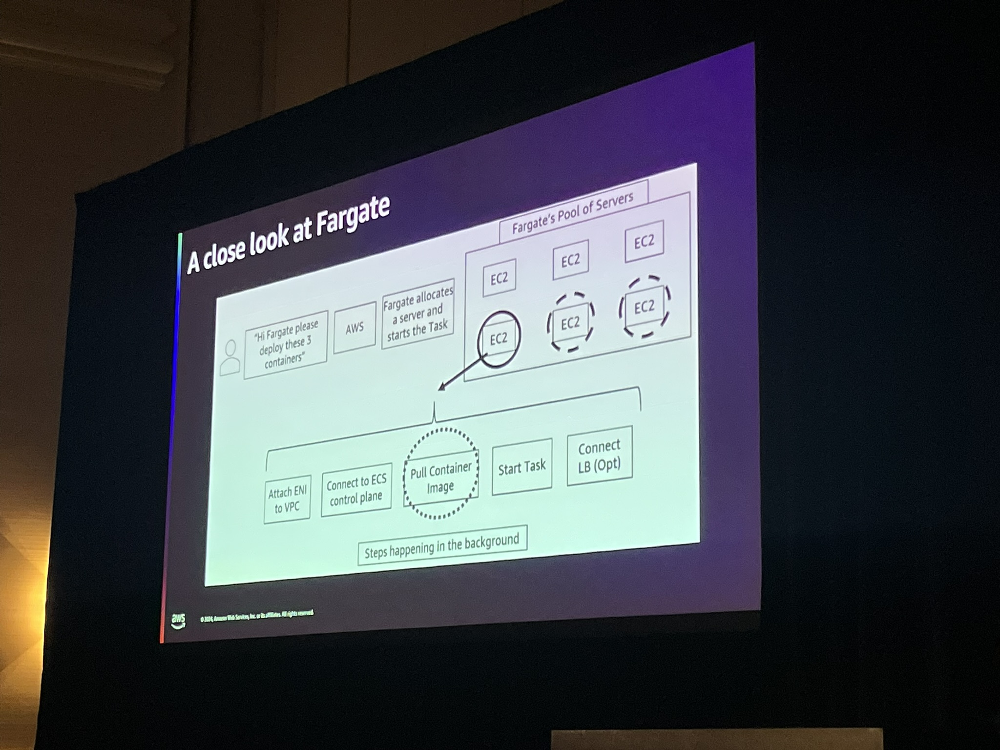
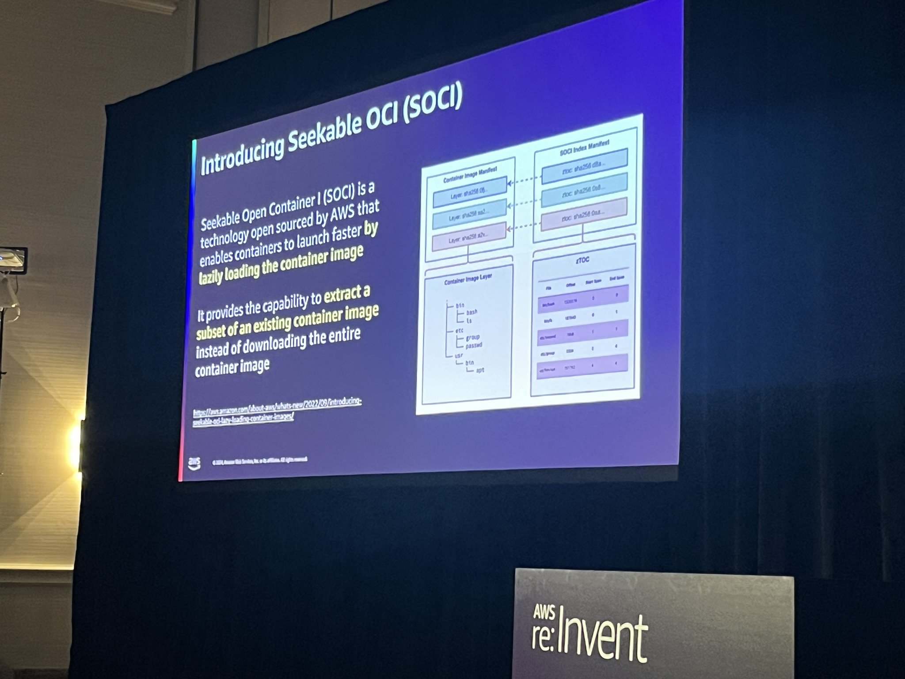
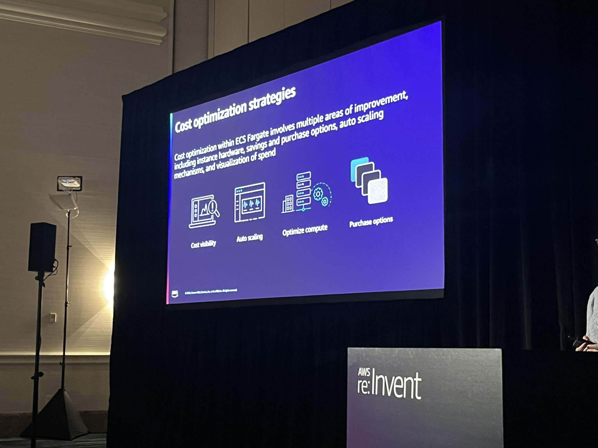

# SVS334-R1 | Optimizing workloads for speed & cost using Amazon ECS and AWS Fargate

AWS Fargate is trusted to run mission-critical workloads around the globe and provides an array of features to help optimize and tune its serverless container workloads. Join this chalk talk to learn how to use new capabilities such as lazy loading of images with Seekable OCI, right-sizing containers through AWS Compute Optimizer, the alternative compression mechanism ZSTD, and more.

**Rachel Leekin:Sr. Containers Specialist Solutions Architect, Amazon Web Services**

**Praveen Edem:Sr. Solutions Architect, Amazon**

### Performance Optimization

Steps happening in the backgroud

 - With Cluster Service we can able to get the metrics for Pull Container Image task

 SOCI - Seekable OCI - Lazy load the image 

 How to create SOCI Index File -> ECR Upload Event -> EB -> Lambda -> API Call to SOCI Index File Creation
 SOCI have performance only when when image size is > 250 MB

 Predictive Scaling (New Feature) - New funtionality to learn the work load profile based on the history. 

 ### Cost Optimization
 - Graviton
 - Compute Optimizer
 - Fargate Spot Instance
 

To Read:
 - Split cost allocation data
