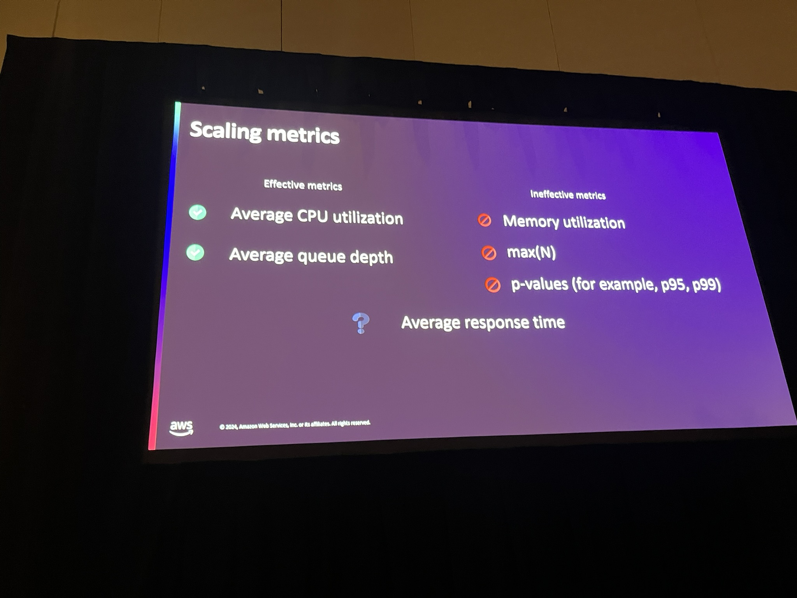
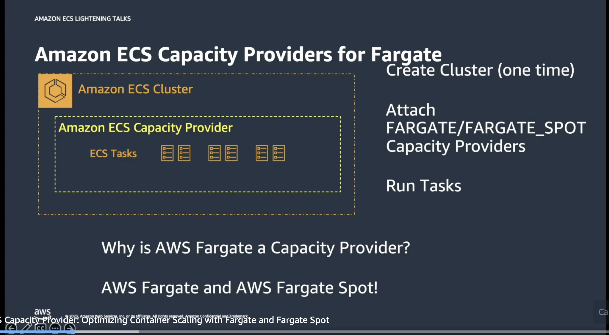

# SVS335 | Scaling to 1000s of containers in minutes with Amazon ECS

Auto scaling is the ability to increase or decrease the desired count of tasks in your Amazon ECS service automatically. In this chalk talk, dive deep into the auto scaling mechanisms of Amazon ECS, including capacity provider and Amazon ECS Service Auto Scaling, for both Amazon EC2 and AWS Fargate workloads. Through real-world use cases, this talk highlights auto scaling options with various metrics specific to different workloads.

**Ratnopam Chakrabarti:Sr. Solutions Architect, Amazon Web Services, Inc.**
**Sushanth Mangalore:Sr. Solutions Architect, AWS**

Recommended Load Testing tools
- [Apache Bench](https://httpd.apache.org/docs/2.4/programs/ab.html)
- [Rakyll Hey](https://github.com/rakyll/hey)
- [Artillery](https://github.com/artilleryio/artillery)

Horizontal Scalling

 - Effective Metrics for scaling
  

 - Target Tracking - Choice of metrics is crucial (Load Profile should match with metrics)
 - Step (Max control to consumer)
 - Schedule
 - Predictive Scaling *New* [Doc](https://aws.amazon.com/blogs/containers/optimize-compute-resources-on-amazon-ecs-with-predictive-scaling/)
    - 14 days work load profile

 - Metric Math in Cloudwatch 

 VPC Endpoint to pull the ECR image instead of public can help to load the image faster. 

#### Capacity Provider 

  - Supports both EC2 and Fargate
  - How to spread tasks
  - Gives an option to choose Compute Option b/w AWS Fargate and AWS Fargate spot
  - Lighting Talk - [Video](https://aws.amazon.com/awstv/watch/a30119192a0/)

Reference Links

[Container Roadmap](https://github.com/aws/containers-roadmap)