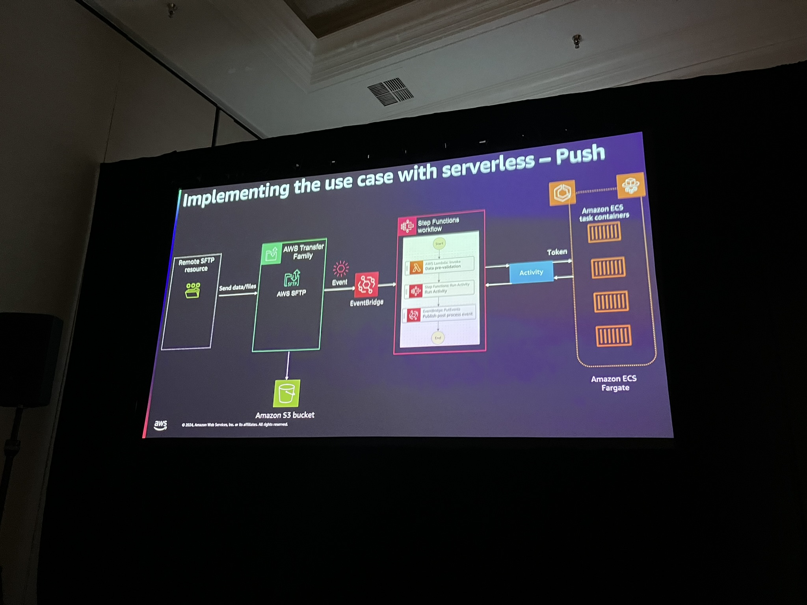

# SVS336 | Serverless data ingestion and processing using containers on Amazon ECS

Unlock the power of serverless data engineering using containers and event-driven architectures on AWS. In this chalk talk, learn how to architect a scalable, cost-efficient serverless solution for data ingestion using Amazon ECS with AWS Fargate, AWS Step Functions, and AWS Transfer Family. Gain practical knowledge through a real-world retail use case that demonstrates how data can be ingested from third-party sources and transformed with AWS serverless services.

**Anand Bilgaiyan: Senior Specialist Partner solution Architect Enterprise Transformation, AWS**

**Eric Johnson: Principal Developer Advocate, AWS**

Notes:

Step Functions activities should be used to perform work outside of the step function. (Document) [https://docs.aws.amazon.com/step-functions/latest/dg/concepts-activities.html]

Functional Architecture - 

End goal - 

TODO
- [ ] ECS Fargate Job
Reference:
