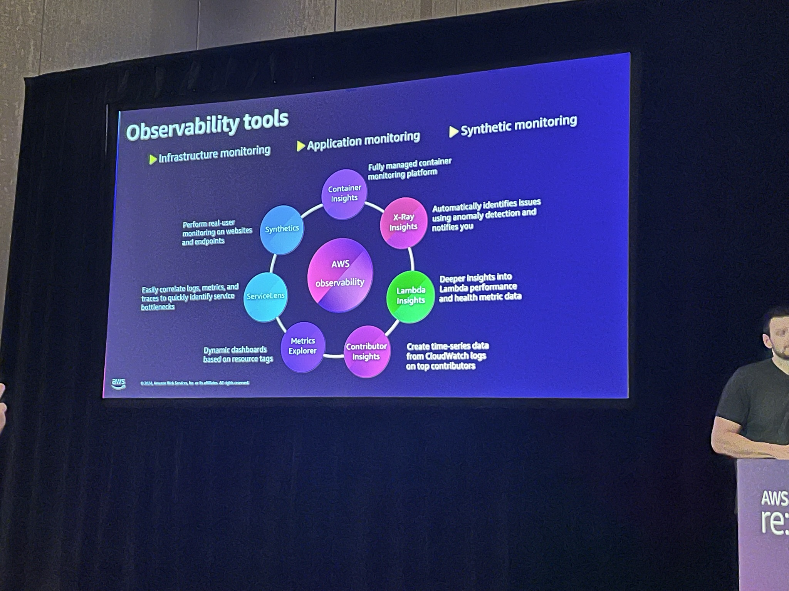

 # ARC320 | Observability strategies for distributed applications on AWS

 In the era of modern, cloud-native applications, distributed systems have become the norm, offering scalability, resilience, and agility. However, with this architectural paradigm shift comes a new set of observability challenges that can hinder effective monitoring, troubleshooting, and optimization. This talk dives deep into the intricacies of observability in distributed systems and explores strategies for leveraging AWS services to overcome these challenges.

**Hendrik Schoeneberg: Principal Data Architect, Amazon Web Services**

**Emanuel Scirlet: Principal Application Architect, AWS**

Final Goal - Reactive Monitoring 

AWS Observability Model

Come up with the unified format for all the application so that it will be easy to enhance insights and to create metrics. 

Observability Tools

Whiteboard - 

Dashboard Strategy

No out of box instrumentation for MSK. We have to annonate manually in the code for trace. 

Embedded Metric Format - Generate CloudWatch metrics embedded within structured log events. The embedded metrics will be extracted so that you can visualize and alarm on them for real-time incident detection. This allows you to monitor aggregated values while preserving the detailed log event context that generates them.
[Java Client](https://github.com/awslabs/aws-embedded-metrics-java)

Cloudwatch RUM (Realtime User Monitoring) - Used for Frontend application. (Similar to Google Analytics, but presenter said it is easy to trace from frontend to backend)
[Docs](https://aws.amazon.com/blogs/aws/cloudwatch-rum/)