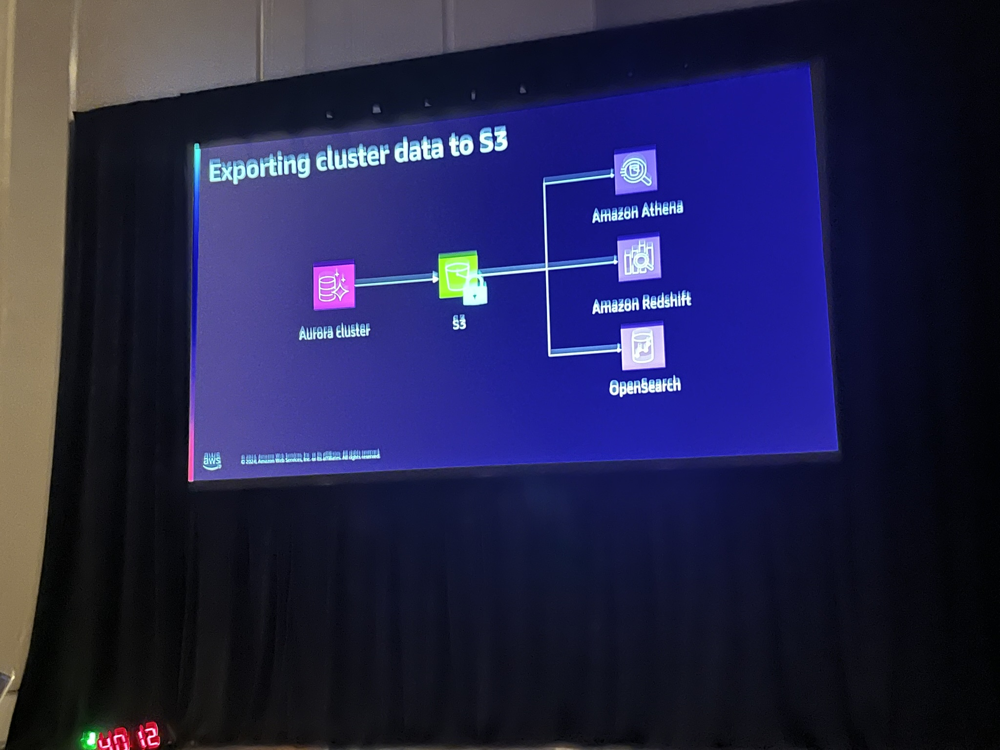

# DAT303-R | Making your Amazon Aurora cluster more resilient

Amazon Aurora is a cloud-native relational database with unparalleled high performance and availability at global scale. Hundreds of thousands of organizations trust Aurora for their workloads today. In this chalk talk, learn about features such as Aurora Global Database and Amazon RDS Proxy, and discover best practices to achieve high availability for your Aurora clusters. The talk includes a whiteboarding session on high availability and disaster recovery solutions to help you maximize your application’s resilience.

**Tim Gustafson : Principal Database Specialist SA, Amazon Web Services**

**Tim Stoakes : Sr. Principal Technologist, Amazon Web Services**

### Aurora Architecture

Point in time - 35 days - Restore to new cluster... 

Cluster --> S3 <-- Object Lock for x days in compliance mode. Not able to mutuate the item even with Admin. 

Exporting the cluster to S3 and can be used for analytics

Aurora Fast Clone - 

AWS JDBC for POstgres (Wrapper around JDBC) - 

- Supporting Fast Failover for Amazon Aurora

[Docs](https://github.com/aws/aws-advanced-jdbc-wrapper)

CPU Utilization
Network Utilization
Buffer Cache Hit Ratio