# SVS414-R1 | Building resilient Amazon ECS applications with chaos engineering

Achieving true resilience for applications running on Amazon ECS requires actively testing and validating your system's ability to withstand failures and unexpected events. In this chalk talk, explore how you can leverage the principles of chaos engineering and tools like AWS Fault Injection Service to inject controlled failures into your Amazon ECS tasks and services. Learn best practices for designing and running impactful chaos experiments that reveal hidden weaknesses and dependencies, and uncover strategies for using the insights from chaos testing to improve the overall availability, scalability, and recoverability of your Amazon ECS applications.

**Maish Saidel-Keesing : Senior Developer Advocate, AWS**

AWS Fault Injection Service
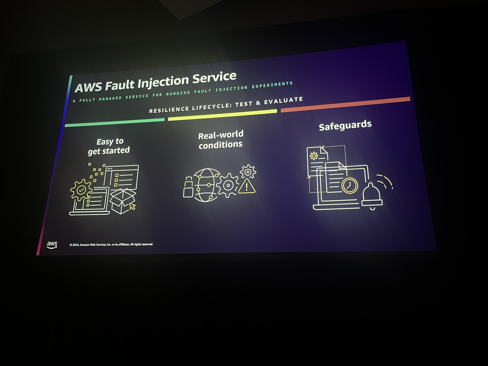

- STRESS
- OBSERVE
- IMPROVE

Steps to create 
Overview
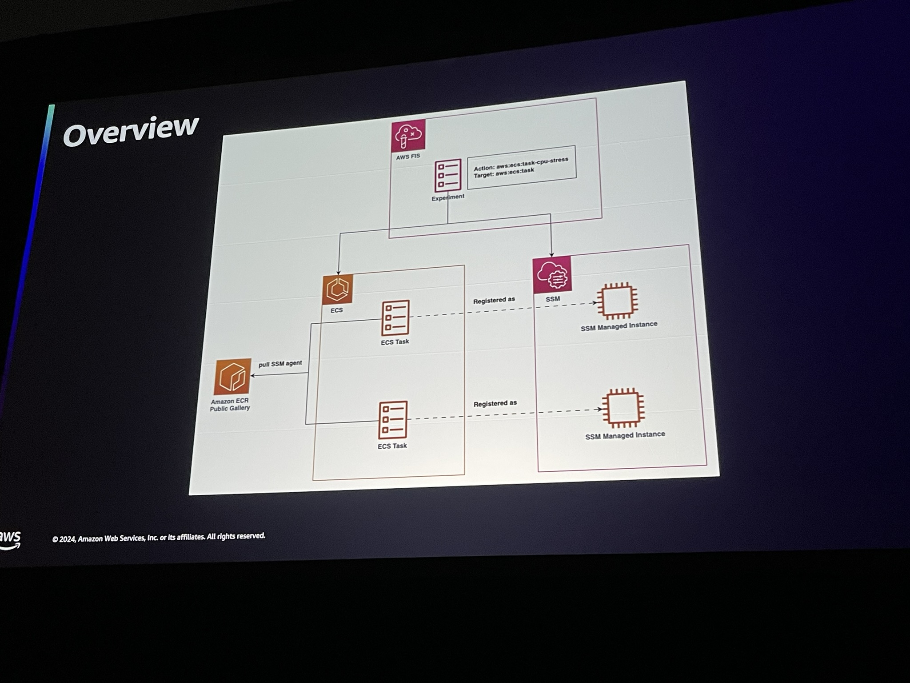

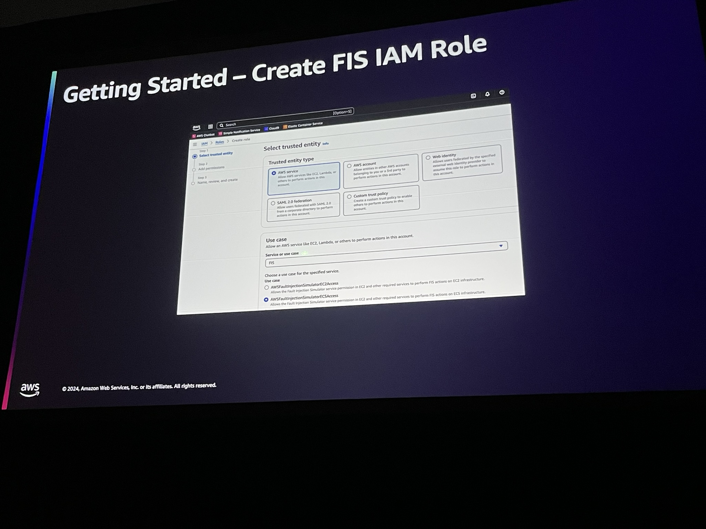 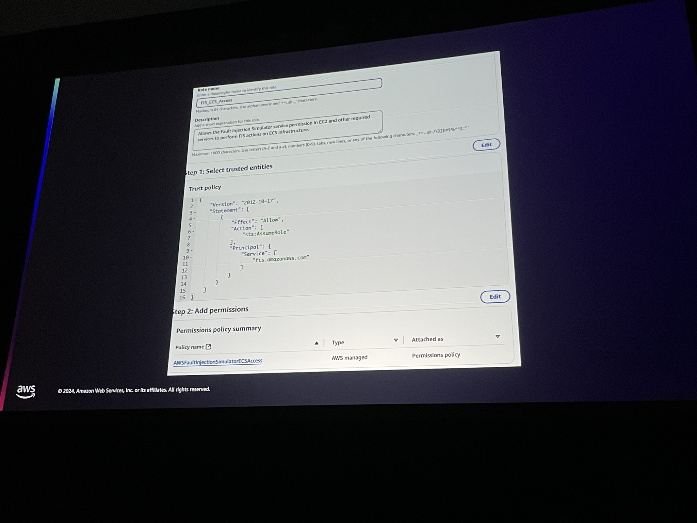 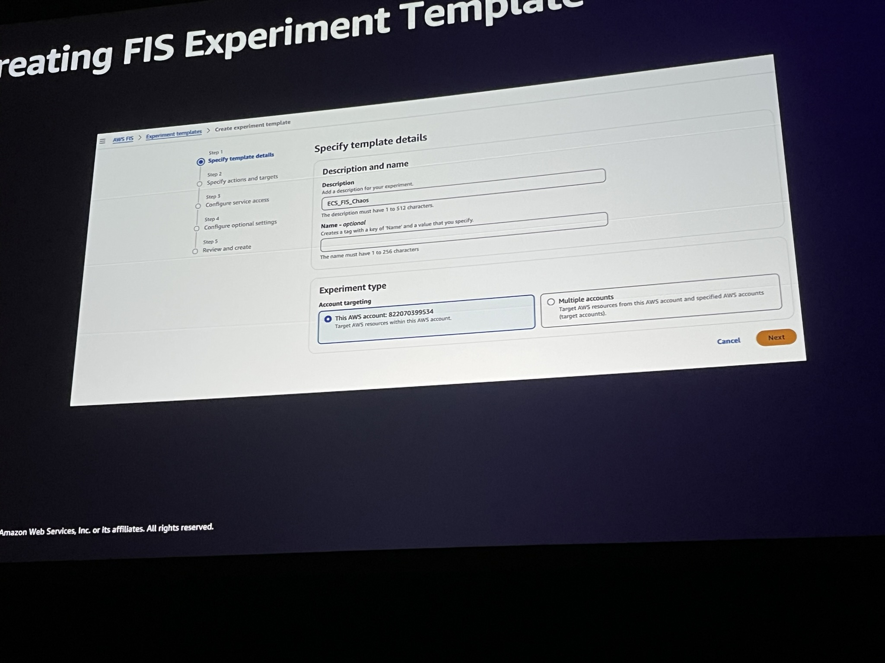 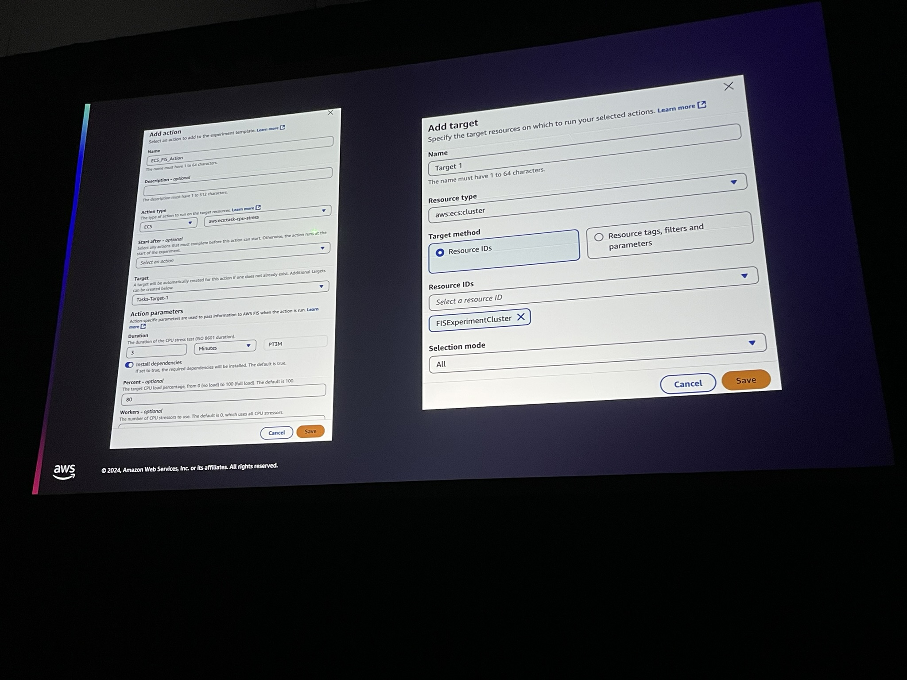 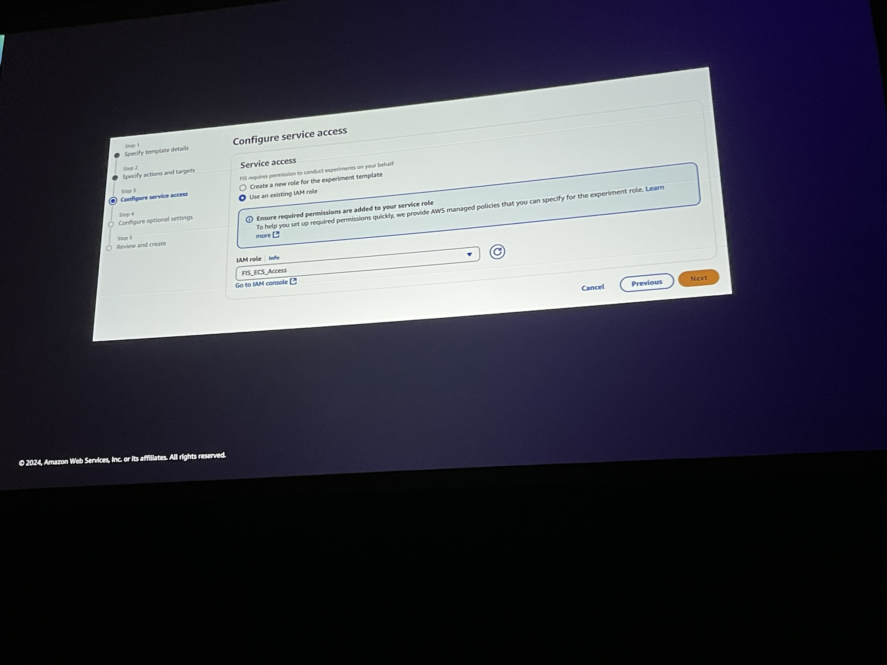 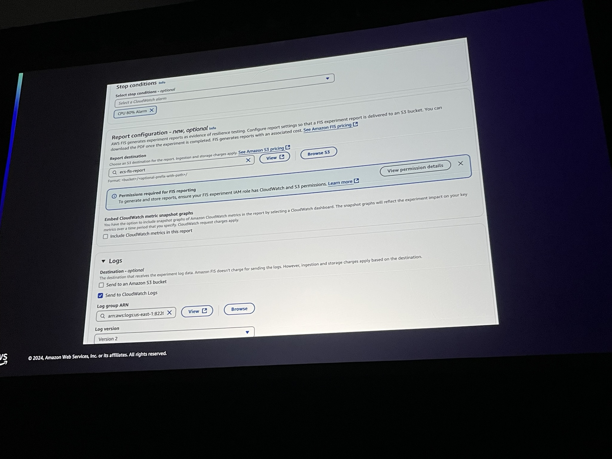 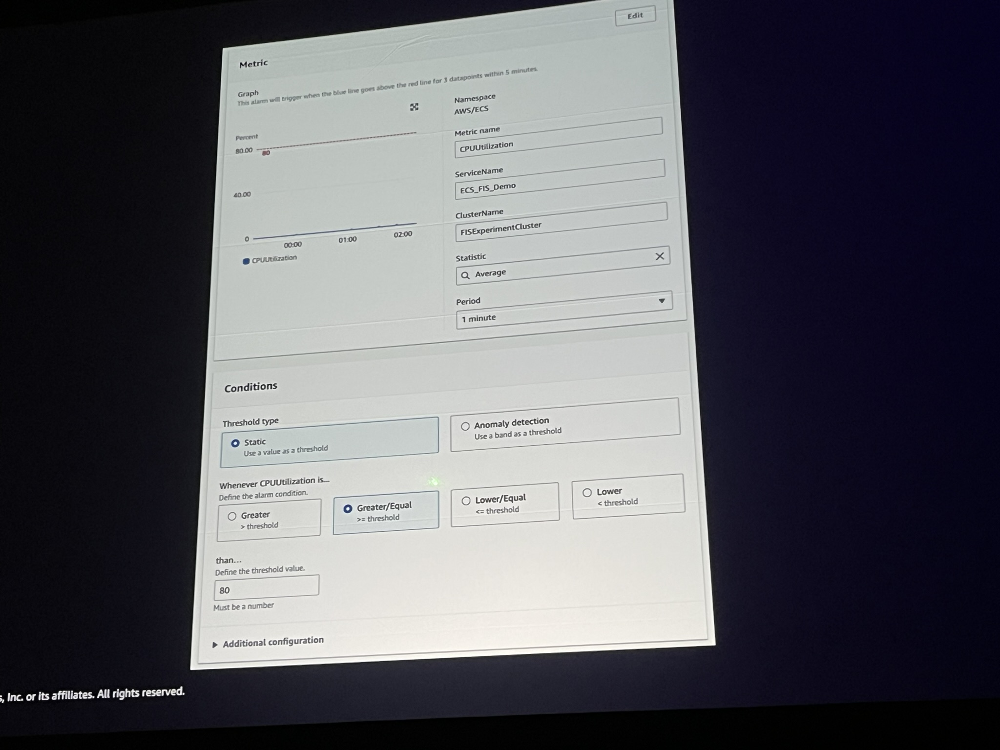 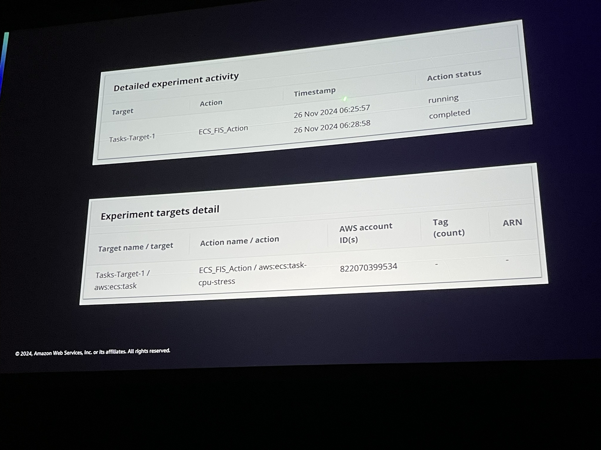 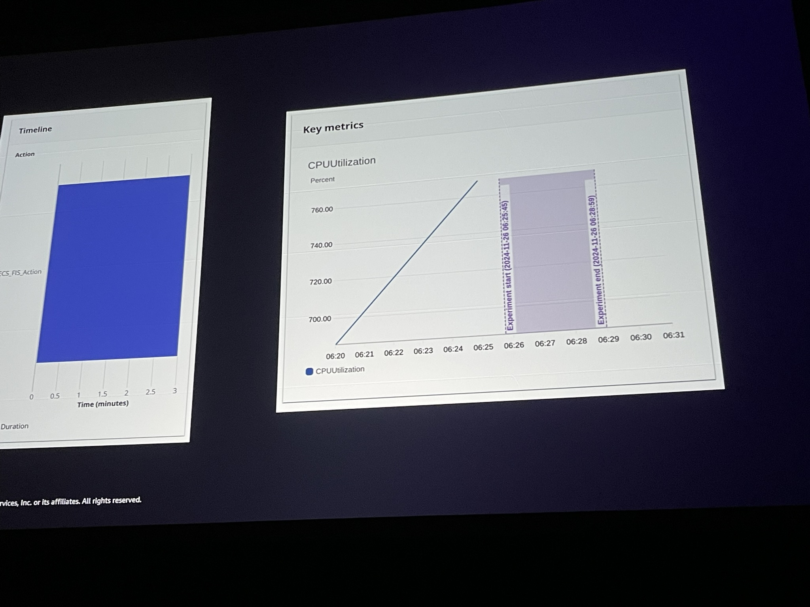 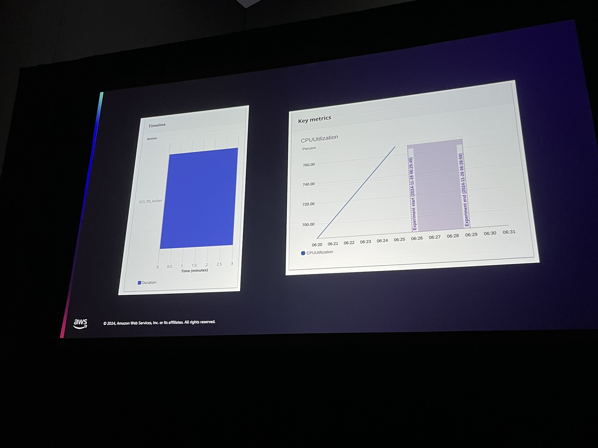

