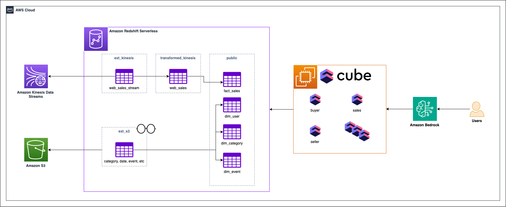

# Building a universal semantic layer on AWS using Cube.js 

Current Challenges

Universal Sematic Layer using [Cube](https://cube.dev/)

 - Agility and flexibility
 - Decoupling deom BI tools
 - Consistent business definitions
 - Features to improve price-performance 

 Automation through Amazon Bedrock Agents
 - Simplify access to first party data
 - Orchestrate multi-step tasks
 - Generate and execute code securely
 - Memory retention across interactions

 Workshop Goal - 

 - Creating a semantic layer for your analytics platform using Amazon Redshift as the data warehouse and Cube as the open-source semantic layer platform.
 - Integrating Cube's universal semantic layer with Amazon Bedrock through the use of Bedrock Agents.
 - Optionally, creating a Streamlit application to provide a user interface for your chatbot.

### Using a semantic layer in implementing this solution allows you to:

 - Centralize business logic in a flexible semantic layer decoupled from your BI tools.
 - Define business terminology, metrics, and KPIs and provide consistently across human users and AI agents.
 - Leverage an out-of-the-box REST APIs to make your data accessible to AI agents.

 Architecture
 

 By leveraging Cube, you can:

Prevent Hallucinations by Providing Semantic Context to AI: Combine Cube's universal semantic layer with large language models (LLMs) to increase the accuracy of generative AI. Semantic layers centralizes business logic definitions, this means that metrics calculations are consistent for both AI agents and human users.

Accelerate AI Chatbot, Agent, and App Development: Give LLMs the context they need to interpret your data accurately and simplify interactions for all skill levels with natural language.

Deliver Trusted Data Faster to Every Use Case: Cube's universal semantic layer ensures that every data endpoint, from BI tools to AI applications, works with the same semantics and underlying data, leading to consistent and trusted insights.

In the next set of labs, we will explore how you can use Cube to build a semantic layer that provides a unified and trusted view of your data, enabling faster and more accurate data-driven decision making across your organization.