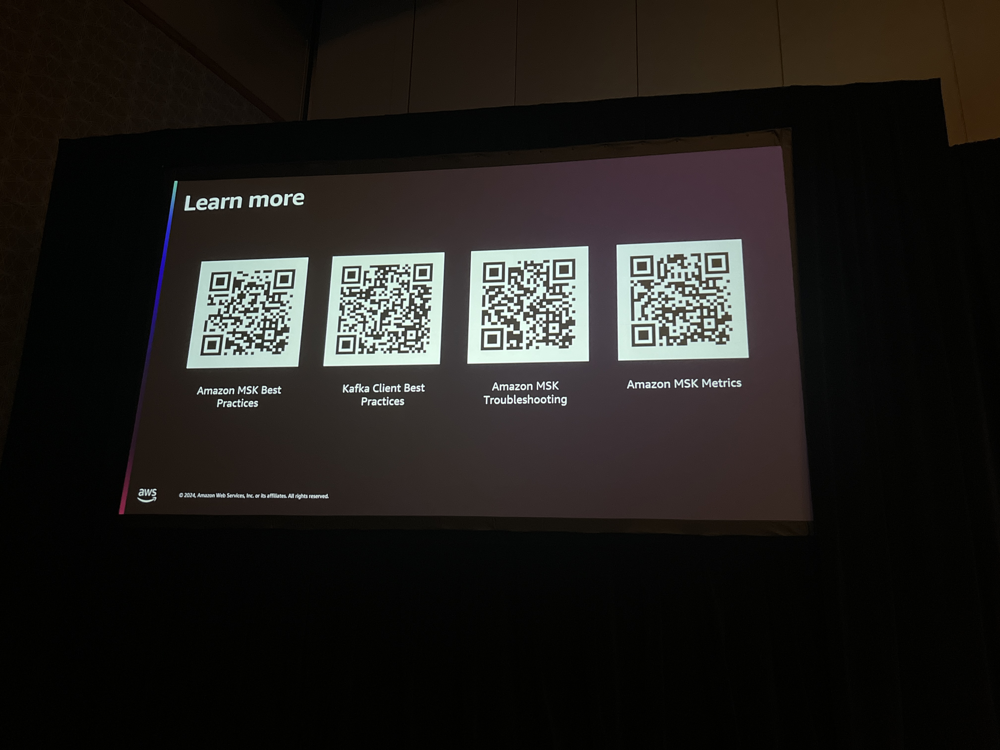
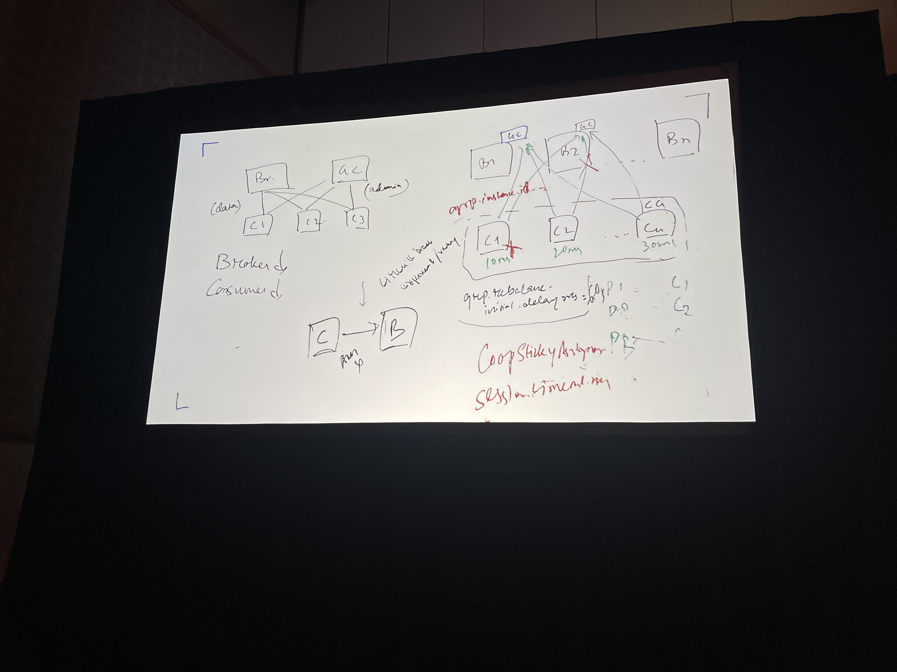

# Build and operate a highly resilient Apache Kafka cluster on AWS 

Notes:

Rack Awareness - Implement fetch from closest replica in Amazon MSK - [Docs](https://aws.amazon.com/blogs/big-data/reduce-network-traffic-costs-of-your-amazon-msk-consumers-with-rack-awareness/)

Kafka doesn't come with Storage by default. MSK have lauched new type called [MSK Express](https://aws.amazon.com/blogs/aws/introducing-express-brokers-for-amazon-msk-to-deliver-high-throughput-and-faster-scaling-for-your-kafka-clusters/) which takes care of the storage. 

[KIP848](https://cwiki.apache.org/confluence/x/HhD1D) issue resolves high number of connection issue caused by Broker replacement or consumer group replace but that feature will be in 4.x version of the kafka. 

We have to spin a new Kafka Cluster while upgrading with Kraft feature and they recommended to use the replicator to hydrate the data. This give us flexibility to roll back if things are not working good with Kraft. 

TODO - 
- [ ] Have to request a support ticket for MSK drift. Engineer from MSK team suggested to take a look at it. If is config drifts, engineers can able to fix it. 
- [ ] Attach the deck from presenter. 

Reference Materials - 

Whiteboard

